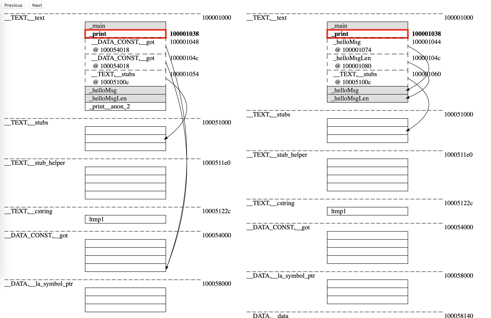

# zig-snapshots

A tool allowing you to preview a series of snapshots of Zig's incremental linker.

## Usage

You will need to build Zig's stage2/self-hosted compiler with `-Dlink-snapshot` flag on:

```
$ zig build -Dlink-snapshot
```

Then, you can run the compiler either in a fire-and-forget or watch-for-updates manner with
`--debug-link-snapshot` flag on to generate a snapshot of the linker's state per incremental update,
all saved in the same JSON output file:

```
$ zig build-exe hello.zig --watch --debug-link-snapshot
> update-and-run
> update-and-run
> exit

$ file snapshots.json
snapshots.json: JSON data
```

You should then feed the output JSON file to `zig-snapshots` which will generate an
HTML file with the linker's state per each incremental update that you can interative with:

```
$ zig-out/bin/zig-snapshots snapshots.json
$ open snapshots.html
```


